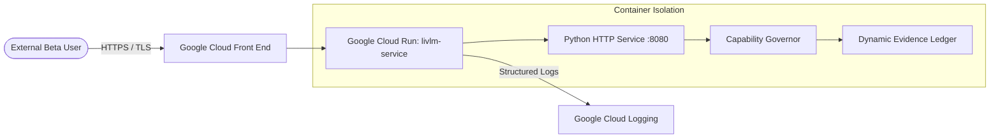

# Google Cloud Deployment Architecture & Status Record

**Service Name:** `livlm-service`  
**Container Image:** `us-central1-docker.pkg.dev/$PROJECT_ID/osiris-livlm/livlm-service:v0.1.0-beta.1`  
**Runtime Platform:** Google Cloud Run (Fully Managed)  
**Release Reference:** `OSIRIS-LIVLM-BETA-0.1.0-REF`  
**Deployment Status:** `BLOCKED_BY_CONSUMER_SUSPENSION`  

---

## 1. Cloud Architecture Overview

The Living Language Model Beta service is packaged as a lightweight, hermetic container designed to run on Google Cloud Run. It exposes stateless HTTP/REST endpoints backed by in-memory governance enforcement and local ledger hash chaining.



---

## 2. Container Specification & Security Hardening

The production container (defined in [`Dockerfile`](file:///home/enki/osiris-governance/Dockerfile)) enforces defense-in-depth:
- **Base Image:** Debian 12 Bookworm slim (`python:3.12-slim-bookworm`).
- **Multi-Stage Build:** Compilation tools (`gcc`) are isolated in the builder stage and completely absent from the final runtime image.
- **Unprivileged Execution:** Runs strictly under `appuser` (`UID 10001`, `GID 10001`). No root privileges.
- **Read-Only Root Filesystem:** Configured to run with `--read-only` flag; requires zero local disk mutation.
- **Zero Subprocesses:** The application image contains no shell scripting hooks or dynamic subprocess execution paths.
- **Zero Native Dependencies:** The service utilizes the Python standard library `http.server.HTTPServer` with `pydantic` for data validation, minimizing third-party CVE surface.
- **Liveness & Readiness Probing:** Built-in healthchecks target `http://127.0.0.1:8080/healthz` and `http://127.0.0.1:8080/readyz`.

---

## 3. Google Cloud Run Configuration Parameters

As specified in [`cloudbuild.yaml`](file:///home/enki/osiris-governance/cloudbuild.yaml):

| Parameter | Configured Value | Security / Performance Rationale |
|---|---|---|
| **Region** | `us-central1` | Proximity to Google Cloud AI and quantum interconnects |
| **CPU Allocation** | `1 vCPU` | Sufficient for deterministic serialization and hashing |
| **Memory Limit** | `512 MiB` | Low memory footprint; prevents memory bloat |
| **Request Timeout** | `60 seconds` | Prevents hanging connections from consuming resources |
| **Concurrency** | `80` | High-throughput concurrent request handling per instance |
| **Auto-scaling** | Min: `0`, Max: `5` | Scale-to-zero when idle; caps cost during beta phase |
| **Ingress** | `all` (Allow unauthenticated) | Allows authorized beta partners and testers access |
| **Port** | `8080` | Standard Cloud Run ingress port |

---

## 4. Current Infrastructure Audit & Root Cause Analysis

During pre-release deployment discovery on 2026-09-26, Google Cloud infrastructure was audited using authenticated credentials (`application_default_credentials.json`).

### Audited GCP Projects

| Project ID | Project Name | State | Root Cause / Blocker |
|---|---|---|---|
| `cs-project-nfhprhbh` | nonprod | `CONSUMER_SUSPENDED` | Cloud Run and Artifact Registry APIs are enabled, but consumer account is suspended. |
| `cs-project-dmjy40jv` | development | `CONSUMER_SUSPENDED` | Account suspended at organization / billing level. |
| `cs-project-heltpd9x` | prod | `CONSUMER_SUSPENDED` | Account suspended. |
| `google-mpf-eas7anl3in0n` | Development-mp | `BILLING_DISABLED` | Billing account detached. |
| `google-mpf-rej95xg0e7bp` | Non-Production-mp | `BILLING_DISABLED` | Billing account detached. |
| `google-mpf-sx6wpoz5xr7v` | Production-mp | `BILLING_DISABLED` | Billing account detached. |

### Diagnostic Command Trace
```bash
$ gcloud run services list --project=cs-project-nfhprhbh
ERROR: (gcloud.run.services.list) PERMISSION_DENIED: The consumer project is suspended.
- '@type': type.googleapis.com/google.rpc.ErrorInfo
  reason: CONSUMER_SUSPENDED
```

### Truthful Epistemic Conclusion
In strict adherence to the project's governing invariants, **we do NOT claim $S_{\text{deployed}} = \text{TRUE}$**.  
The deployment status is recorded as:
$$\mathbf{S}_{\text{deployed}} = \mathbf{UNVERIFIED \,\, (BLOCKED\_BY\_CONSUMER\_SUSPENSION)}$$

---

## 5. Deployment Remediation Roadmap

To achieve live deployment once GCP account administrative access is restored:

1. **Reinstate GCP Project:**
   ```bash
   # Re-activate billing or resolve suspension in Google Cloud Console
   gcloud alpha billing projects link cs-project-nfhprhbh --billing-account=ACCOUNT_ID
   ```
2. **Execute Cloud Build:**
   ```bash
   gcloud builds submit --project=cs-project-nfhprhbh --config=cloudbuild.yaml .
   ```
3. **Verify Public Endpoints:**
   ```bash
   SERVICE_URL=$(gcloud run services describe livlm-service --project=cs-project-nfhprhbh --format='value(status.url)')
   curl -s "${SERVICE_URL}/healthz" | jq .
   curl -s "${SERVICE_URL}/v1/provenance" | jq .
   ```
4. **Update Ledger:**
   Record the live deployment URL and container image digest into the `DynamicEvidenceLedger`, promoting $S_{\text{deployed}}$ to `TRUE`.
