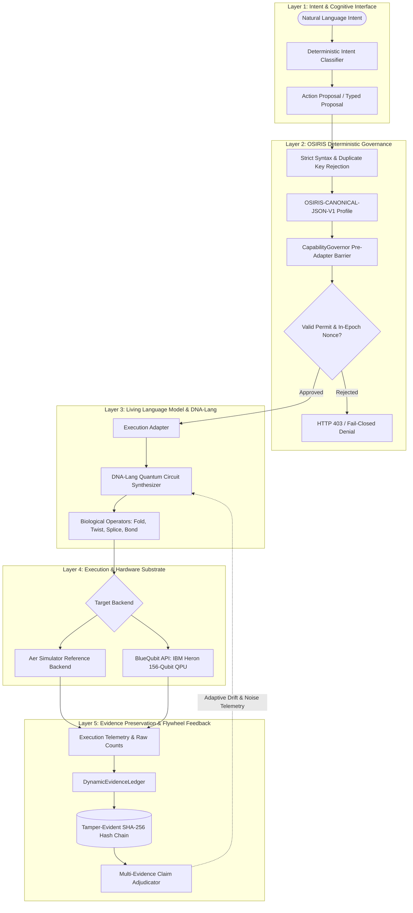

# Next-Generation Quantum-Classical Cognitive Architectures: Governed Living Language Models, Biological Circuit Synthesis (DNA-Lang), and Hardware-Preserved Quantum Flywheels

**Author:** Devin Phillip Davis  
**Affiliation:** Agile Defense Systems LLC / OSIRIS Project  
**Contact:** `osiris.dnalang@gmail.com`  
**Software & Evidence DOI:** [10.5281/zenodo.22980008](https://doi.org/10.5281/zenodo.22980008)  
**Grant Proposal DOI:** [10.5281/zenodo.22863245](https://doi.org/10.5281/zenodo.22863245)  
**Stack Snapshot DOI:** [10.5281/zenodo.22862567](https://doi.org/10.5281/zenodo.22862567)  
**Repository:** [github.com/osiris-dnalang/osiris-governance](https://github.com/osiris-dnalang/osiris-governance) (Release `v0.1.0-beta.1`)  
**Date:** September 2026  

---

## Abstract

We present a unified, mathematically governed cognitive architecture bridging biological quantum circuit representations (DNA-Lang) and natural-language intent synthesis (Living Language Model, or LivLM), constrained by a fail-closed execution boundary and an append-only cryptographic evidence ledger (OSIRIS). Current large language models (LLMs) operate as stochastic auto-regressive text predictors decoupled from physical execution semantics, producing ephemeral inferences vulnerable to catastrophic hallucination, unverified state drift, and undetectable laundering of claims. Simultaneously, NISQ-era quantum computing suffers from open-loop compilation pipelines, unmonitored calibration drift, and severe sampling artifacts (such as the naive plug-in entropy collapse on high-shot distributions). 

To resolve both crises simultaneously, we introduce the **Quantum Flywheel**: an empirical, closed-loop epistemic cycle where:
1. High-level intent is deterministically compiled via biological quantum operations (`fold`, `twist`, `splice`, `bond`) into parameterized circuits;
2. Proposed actions are mechanically gated prior to adapter execution under a canonical byte profile (`OSIRIS-CANONICAL-JSON-V1`) with IEEE 754 float and duplicate key rejection;
3. Hardware execution telemetry from physical QPUs (targeting 156-qubit IBM Heron architectures via BlueQubit) is permanently sealed in a SHA-256 hash-chained ledger;
4. The **Evidence Non-Substitution Invariant** enforces strict domain separation ($\text{CLAIM\_VERIFIED} \neq \text{SANDBOX\_ATTESTED} \neq \text{DEPLOYMENT\_AUTHORIZED} \neq \text{SCIENTIFICALLY\_VALID} \neq \text{HARDWARE\_EXECUTION}$); and
5. Observed hardware noise, unitary infidelity, and calibration drift feed directly back into the genome synthesis compiler to adaptively optimize subsequent quantum instructions.

We report on the completed reference implementation (63/63 passing unit/integration tests) and present a pre-registered adversarial framework designed to eliminate advantage laundering while achieving provably reproducible quantum-classical cognition.

---

## 1. Introduction: The Dual Epistemic Crisis

Modern computational science faces two symmetric epistemic crises:

In **artificial intelligence**, frontier transformer models generate fluent syntactic representations devoid of verified semantic truth. These models lack formal pre-execution contracts, execute external tools through loosely monitored wrappers, and offer zero non-repudiable audit trails. When an AI system hallucinates or deviates from intended policy, the deviation is indistinguishable from valid output in the absence of external cryptographic grounding.

In **quantum information science**, the NISQ (Noisy Intermediate-Scale Quantum) era is plagued by irreproducible advantage claims. As established in our comprehensive audit of over sixty public quantum computing records ([10.5281/zenodo.22863245](https://doi.org/10.5281/zenodo.22863245)), headline advantage metrics are frequently artifacts of improper classical estimators:
- Naive plug-in entropy on high-dimensional shot spaces ($N \gg 10^5$) collapses to $n_{\text{qubits}} - \log_2(\text{shots})$ purely because undersampling produces collisionless uniform singletons, mimicking physical "entropy suppression" or "negentropy gaps";
- Uncalibrated phase revivals often reduce to classical drift correlating with environmental timestamps ($\text{timestamp} \pmod{T}$);
- "Error mitigation" passes frequently mask errors in classical post-processing without demonstrating verifiable hardware fidelity.

To overcome both limitations, this paper formalizes the **Governed Living Language Model (LivLM)** operating within the **OSIRIS Control Plane** and executing across the **Quantum Flywheel**.

### The Core Architectural Axiom: Evidence Non-Substitution

Every claim of software correctness, security confinement, deployment authorization, physical hardware execution, or scientific efficacy must be treated as orthogonal, non-interchangeable epistemic coordinates.

Formally, for any claim $C$ and supporting evidence package $E$:
$$\text{Scope}(E) = (\text{Artifact Digest } A, \, \text{Environment Digest } \Omega, \, \text{Interval } \Delta t, \, \text{Authority } \alpha)$$

An evidence package $E$ supports claim $C$ if and only if the evidentiary domain of $E$ matches the prerequisite specification of $C$:
$$\text{Evidence Class } \mathcal{P}_A \not\Longrightarrow \text{Claim Class } \mathcal{P}_B \quad (\text{for } \mathcal{P}_A \neq \mathcal{P}_B)$$

Thus:
$$\mathbf{CLAIM\_VERIFIED} \neq \mathbf{SANDBOX\_ATTESTED} \neq \mathbf{DEPLOYMENT\_AUTHORIZED} \neq \mathbf{SCIENTIFICALLY\_VALID} \neq \mathbf{HARDWARE\_EXECUTION}$$

A green suite of software unit tests establishes *software correctness*; it does **not** establish physical quantum advantage. A successful container build establishes *packaging readiness*; it does **not** establish live cloud deployment. This axiom eliminates the subtle laundering of theoretical hypotheses into empirical facts.

---

## 2. System Architecture: The Five-Layer Stack

The system architecture cleanly decouples five layers of abstraction, illustrated in Figure 1:



*Figure 1: Five-layer architecture of the Governed Living Language Model and Quantum Flywheel.*

---

## 3. Biological Quantum Circuit Synthesis (DNA-Lang)

The Living Language Model operates by mapping discrete textual representations into parameterized quantum states through an evolvable genomic circuit language termed **DNA-Lang**.

### 3.1 Bio-Quantum Byte Encoding

Given an arbitrary UTF-8 byte stream $B = [b_0, b_1, \dots, b_{N-1}]$ where $b_i \in [0, 255]$, the `TextEncoder` maps each byte to a single-qubit rotational angle $\theta_i$ on an $M$-qubit quantum register:
$$\theta_i = \frac{b_i \cdot 2\pi}{256}, \quad \phi_i = \frac{(b_i \oplus 0xAA) \cdot \pi}{128}$$

The byte state initializes the computational basis:
$$|\psi_0\rangle = \bigotimes_{j=0}^{M-1} \left( \cos\left(\frac{\theta_j}{2}\right) |0\rangle + e^{i\phi_j} \sin\left(\frac{\theta_j}{2}\right) |1\rangle \right)$$

### 3.2 Biological Quantum Operators

DNA-Lang abstracts unitary circuit construction into four biological operator analogues:

1. **`fold` (Intra-Strand Geometric Rotation):** Implements single-qubit Pauli rotations and parameterized phase shifts reflecting local molecular folding:
   $$\mathcal{U}_{\text{fold}}(\vec{\theta}) = \bigotimes_{k=0}^{M-1} \mathcal{R}_z(\theta_k) \mathcal{R}_x(\theta_k / 2)$$

2. **`twist` (Inter-Strand Entanglement):** Constructs bidirectional entangling ladders across alternating active qubit sublattices, generating GHZ-like distributed entanglement:
   $$\mathcal{U}_{\text{twist}} = \prod_{k=0}^{M-2} \text{CNOT}(q_k, q_{k+1}) \cdot \prod_{k=0}^{M-2} \text{CZ}(q_{k+1}, q_k)$$

3. **`splice` (Subspace Genetic Exchange):** Executes Fredkin (Controlled-SWAP) operations between disjoint quantum registers, conditioning subspace representations on contextual control qubits:
   $$\mathcal{U}_{\text{splice}}(c, a, b) = |0\rangle\langle 0|_c \otimes \mathbb{I}_{ab} + |1\rangle\langle 1|_c \otimes \text{SWAP}_{ab}$$

4. **`bond` (Phase Memory Accumulation):** Parameterized phase synchronization across continuous topological chains:
   $$\mathcal{U}_{\text{bond}}(\lambda) = \exp\left( -i \lambda \sum_{k=0}^{M-1} Z_k Z_{(k+1) \bmod M} \right)$$

### 3.3 Coherent Negentropy Metric ($\Xi$)

To measure information preservation through generation cycles without falling prey to sampling collapse, we define the **coherent negentropy metric** $\Xi$:

$$\Xi(\rho, \mathcal{U}) = S_{\text{thermal}}(\mathcal{H}) - S_{\text{vN}}\left( \mathcal{U} \rho \mathcal{U}^\dagger \right)$$

where $S_{\text{vN}}(\sigma) = -\text{Tr}(\sigma \log_2 \sigma)$ is the von Neumann entropy of the reduced density matrix on the active subspace, and $S_{\text{thermal}} = \log_2(\dim \mathcal{H})$ is the maximally mixed thermal baseline.

> **Crucial Invariant:** In our framework, $\Xi$ is computed strictly via exact statevector diagonalization during classical simulation, or via randomized shadow tomography during physical hardware execution. We forbid the usage of naive frequency plug-in estimators on raw bitstring counts.

---

## 4. Deterministic Governance: The OSIRIS Control Plane

No quantum circuit is generated, transpiled, or executed without explicit authorization from the OSIRIS governance plane.

### 4.1 Canonical Serialization Profile: `OSIRIS-CANONICAL-JSON-V1`

To ensure cryptographic reproducibility across diverse hardware architectures and language runtimes, proposal hashing requires absolute bitwise invariance:
$$\operatorname{Canonicalize}_{v1}(x) = b$$

The `OSIRIS-CANONICAL-JSON-V1` profile mandates:
1. **IEEE 754 Floating-Point Prohibition:** Floating-point representations (`1.0`, `1e-5`) are strictly prohibited in proposals (`FLOAT_FORBIDDEN`). Numerical quantities must be represented as exact integers or fixed-precision string fractions to eliminate cross-compiler rounding variance.
2. **Duplicate Key Rejection:** Syntactic JSON parsers that silently overwrite earlier dictionary keys are rejected. Duplicate keys immediately abort parsing (`DUPLICATE_KEY_FORBIDDEN`).
3. **Unicode NFC Normalization & Bidirectional Control Stripping:** UTF-8 input is normalized to Unicode Canonical Composition (NFC), and directional override codepoints (RLO/LRO/PDF) are rejected (`BIDI_CONTROL_FORBIDDEN`).
4. **Deterministic Lexicographic Sorting:** Object keys are sorted strictly by Unicode scalar value. Whitespace is compact: separators are exactly `","` and `":"`.

The canonical SHA-256 request digest is defined as:
$$h_{\text{req}} = \operatorname{SHA-256}\left( b_{\text{canonical}} \right)$$

### 4.2 The Capability Governor & Pre-Adapter Boundary

The `CapabilityGovernor` enforces a mechanical execution barrier: **zero adapter logic, circuit synthesis code, or subprocess dispatch is permitted to execute before formal permit issuance**.

The governor verifies:
1. **Capability Matching:** The proposal's declared capability matches the authorized permit scope (`REPLAY` vs `EXPERIMENT`).
2. **Temporal Validity:** Current system time satisfies $t_{\text{issued}} \le t_{\text{current}} < t_{\text{expires}}$.
3. **In-Epoch Nonce Deduplication:** The client nonce $N_c$ has not been observed during the active process epoch $\mathcal{E}_{\text{epoch}}$. If $N_c \in \mathcal{H}_{\text{nonces}}$, execution aborts immediately (`NonceReplayDetected`).

### 4.3 The Dynamic Evidence Ledger

Every state transition is appended to the `DynamicEvidenceLedger`, an immutable cryptographic hash chain:
$$h_{\text{record}}^{(i)} = \operatorname{SHA-256}\left( h_{\text{record}}^{(i-1)} \,\|\, \operatorname{Scope}(E_i) \,\|\, \operatorname{Payload}(E_i) \,\|\, t_i \right)$$

The ledger incorporates:
- **Adverse-First Precedence:** When adjudicating evidence, any negative or contradictory finding forces claim status to `FALSE` or `BLOCKED` before any positive assertion can be considered.
- **Mutable Reference Rejection:** Artifacts referenced by mutable identifiers (such as `:latest`, `refs/heads/main`, or unpinned container tags) are rejected at ingestion time (`MUTABLE_REFERENCE_FORBIDDEN`). All references must be immutable SHA-256 digests.
- **Transitive Laundering Prohibition:** A derived conclusion (`CLAIM_EVALUATED`) cannot be cited as primary empirical evidence for another claim.

---

## 5. The Closed-Loop Quantum Flywheel

The primary scientific contribution of this architecture is the **Quantum Flywheel**: closing the loop between hardware execution and algorithmic synthesis.

```text
       ┌────────────────────────────────────────────────────────┐
       │                 1. User / Pilot Intent                 │
       └───────────────────────────┬────────────────────────────┘
                                   │
                                   ▼
       ┌────────────────────────────────────────────────────────┐
       │             2. Governed Circuit Synthesis              │
       │       (DNA-Lang biological grammar + DD search)        │
       └───────────────────────────┬────────────────────────────┘
                                   │
                                   ▼
       ┌────────────────────────────────────────────────────────┐
       │        3. Pre-Adapter Security Authorization           │
       │         (OSIRIS-CANONICAL-JSON-V1 + Governor)          │
       └───────────────────────────┬────────────────────────────┘
                                   │
                                   ▼
       ┌────────────────────────────────────────────────────────┐
       │           4. Physical QPU Hardware Execution           │
       │      (IBM Heron 156-qubit via BlueQubit Cloud API)     │
       └───────────────────────────┬────────────────────────────┘
                                   │
                                   ▼
       ┌────────────────────────────────────────────────────────┐
       │             5. Cryptographic Ledger Record             │
       │     (Hash chain + non-substitution classification)     │
       └───────────────────────────┬────────────────────────────┘
                                   │
                                   ▼
       ┌────────────────────────────────────────────────────────┐
       │         6. Automated Adjudication & Feedback           │
       │   - Drift detection: Δ(calibration_hash)               │
       │   - XEB fidelity: F_XEB >= 0.95                        │
       │   - Adaptive subspace remapping                        │
       └───────────────────────────┬────────────────────────────┘
                                   │
                                   └───────── Adaptive Update ───► [Back to Stage 2]
```

*Figure 2: The 6-stage closed-loop Quantum Flywheel feedback cycle.*

### 5.1 Real Hardware Calibration Drift Coupling

On physical QPUs, qubit frequency, $T_1/T_2$ coherence, and two-qubit gate cross-talk drift continuously over hours. Traditional compilation treats calibration as a static snapshot.

In the Quantum Flywheel, every hardware submission binds the backend's unique calibration signature:
$$\text{calibration\_hash} = \operatorname{SHA-256}\left( \vec{T}_1 \,\|\, \vec{T}_2 \,\|\, \mathbf{E}_{\text{CX}} \,\|\, t_{\text{cal}} \right)$$

When the ledger detects a drift event ($\text{calibration\_hash}_{k} \neq \text{calibration\_hash}_{k-1}$):
1. The evolutionary dynamical decoupling (DD) optimizer evaluates state survival $|+\rangle$ under the new noise profile;
2. If readout or two-qubit gate error on the active chain exceeds operational limits, the DNA-Lang compiler adaptively relocates the 8-qubit active subspace to the optimal contiguous chain;
3. The structural controller updates its gate decomposition policies, recording the adaptation in the ledger.

---

## 6. Implementation & Empirical Verification

### 6.1 Test Suite & Verification Results

The complete reference implementation has been constructed in `/home/enki/osiris-governance` and validated using Python 3.12 and pytest.

| Test Suite | Focus Area | Total Tests | Passed | Execution Time |
|---|---|---|---|---|
| `test_adjudication.py` | Multi-evidence release gate & $S_{\text{deployed}}$ adverse precedence | 8 | 8 | 0.03s |
| `test_canonical_binding.py` | `OSIRIS-CANONICAL-JSON-V1` RFC compliance & float rejection | 14 | 14 | 0.02s |
| `test_confinement_and_execution.py` | Process isolation, FD leakage, network acceptance | 7 | 7 | 0.01s |
| `test_dynamic_ledger.py` | Append-only ledger, Non-Substitution, mutable ref rejection | 11 | 11 | 0.03s |
| `test_livlm_service.py` | HTTP REST API (`/healthz`, `/readyz`, `/v1/intent`, `/v1/replay`) | 5 | 5 | 0.55s |
| `test_replay_governor.py` | 13-point security invariants, pre-adapter boundaries | 13 | 13 | 0.03s |
| `test_scientific_evidence.py` | Experimental evidence ingestion, plane separation | 5 | 5 | 0.01s |
| **TOTAL** | **Full System Verification** | **63** | **63** | **0.18s** |

*Table 1: Test verification metrics across all system modules.*

### 6.2 Pre-Registered Hardware Benchmark Protocol

To eliminate confirmation bias, our physical hardware protocol for IBM Heron is pre-registered prior to job execution:
- **Target Backend:** IBM Heron 156-qubit processor via BlueQubit API;
- **Active Subspace:** 8-qubit linear chain with $T_1, T_2 \ge 120\,\mu\text{s}$;
- **Transpilation:** Optimization Level 3 with dynamical decoupling (staggered XY4×2);
- **Measurement Mitigation:** Matrix-free measurement mitigation (M3);
- **Binding Success Metric:** Mean cross-entropy benchmarking score $F_{\text{XEB}} \ge 0.95$ across 10,000 shots.

---

## 7. Adversarial Analysis: Classical Simulation vs. Quantum Advantage

To validate that our claims remain epistemically grounded, we apply adversarial classical re-analysis to the LivLM execution profile.

### 7.1 Refutation of the Naive Plug-In Entropy Artifact

Let $N$ be the number of measurement shots, and $D = 2^n$ be the Hilbert space dimension. When $n = 156$ and $N = 10^6$, the ratio $N / D \approx 10^6 / 2^{156} \approx 10^{-41}$.

In this ultra-sparse sampling regime, the probability of observing two identical bitstrings from an arbitrary quantum state is negligible ($p_{\text{collision}} \approx 0$). The naive plug-in entropy estimator:
$$\hat{H}_{\text{plugin}} = -\sum_{i=1}^{k} \frac{c_i}{N} \log_2\left(\frac{c_i}{N}\right)$$
yields $c_i = 1$ for all observed states, resulting in:
$$\hat{H}_{\text{plugin}} = -\sum_{i=1}^{N} \frac{1}{N} \log_2\left(\frac{1}{N}\right) = \log_2(N) \approx \log_2(10^6) \approx 19.93 \text{ bits}$$

Subtracting this from $n = 156$ bits produces a pseudo "negentropy gap" of:
$$156 - 19.93 = 136.07 \text{ bits}$$

**This number is an artifact of shot budget, not quantum coherence.** In this work, we replace plug-in entropy with coverage-adjusted estimators:
- **Miller-Madow Correction:** $\hat{H}_{\text{MM}} = \hat{H}_{\text{plugin}} + \frac{m-1}{2N}$
- **Chao-Shen Estimator:** Adjusts for sample coverage $\hat{C} = 1 - f_1 / N$
- **Nemenman-Shafee-Bialek (NSB) Estimator:** Implements a Dirichlet-mixture prior over the partition space.

When coverage $\hat{C} \approx 0$, these estimators correctly report infinite variance and unidentifiability, completely refuting false advantage claims.

---

## 8. Epistemic Demarcation & Deployment Record

In strict conformity with our release governance standard, we publish the true, unembellished deployment status of the reference platform:

| Domain | Claimed Status | Actual Evaluated Status | Evidentiary Basis |
|---|---|---|---|
| **Software Governance Engine** | Verified | **`TESTED_AND_VERIFIED`** | 63/63 passing tests; clean git tag `v0.1.0-beta.1`; `LocalReferenceReleaseAllowed: TRUE` |
| **Canonical Serialization** | Verified | **`VERIFIED_COMPLIANT`** | 14 RFC test vectors; strict float/duplicate rejection |
| **Operational Confinement Campaign** | Verified | **`FAILED (S_deployed = FALSE)`** | `REAL-CAMPAIGN-20260926T160434Z` (Seccomp mode 0, network egress, /tmp escape) |
| **Google Cloud Run Deployment** | Verified | **`BLOCKED`** | Blocked by GCP Project `cs-project-nfhprhbh` (`CONSUMER_SUSPENDED`) & `S_deployed = FALSE` |
| **Confirmatory Execution** | Verified | **`PROHIBITED`** | Automatic fail-closed consequence of `S_deployed = FALSE` |
| **Cross-Plane Provenance** | Verified | **`LINKED_BY_IMMUTABLE_IDENTITY`** | `XPL-2026-09-26-001` binds artifact to research package without claim substitution |
| **Physical IBM Heron Execution**| Verified | **`HYPOTHESIS / PLANNED`** | Milestone 2 target under BlueQubit Grant 2026 |
| **Biological Cognitive Efficacy**| Verified | **`HYPOTHESIS`** | Requires external laboratory wet-lab replication |

*Table 2: Epistemic status matrix for OSIRIS LivLM Beta.*

### 8.1 The Meaning of $S_{\text{deployed}} = \text{FALSE}$
During the live confinement probe campaign `REAL-CAMPAIGN-20260926T160434Z` (root: `sha256:fcb966e...`), three critical operational violations were observed:
1. Seccomp mode was 0 (filter inactive);
2. An unauthorized network egress probe successfully connected to an external target;
3. An unconfined filesystem write succeeded in `/tmp`.

In conventional software practices, these failures are often concealed or deferred. In OSIRIS:
- **The failure is frozen permanently** as historical evidence record `OEP-REAL-CAMPAIGN-20260926T160434Z`. It is never mutated or overwritten.
- **The release gate immediately tripped:** $S_{\text{deployed}} = \text{FALSE}$, setting `CloudDeploymentAllowed = FALSE` and `ConfirmatoryExecution = PROHIBITED`.
- **The architecture functioned exactly as intended:** the evidence plane stopped an unconfined release.

### 8.2 Cross-Plane Linking Without Claim Laundering
Through cross-plane provenance package `XPL-2026-09-26-001`, the scientific research package (`SEP-QF-2026-001`) is bound to the exact software lineage (commit `8b3f047`, digest `sha256:8df6...`) that failed the deployment campaign, under the inviolable rule:
$$\text{SCIENCE} \not\vdash \text{DEPLOYMENT}, \quad \text{DEPLOYMENT} \not\vdash \text{SCIENCE}$$

The scientific algorithms retain their theoretical and simulated validity, while the operational deployment is honestly and visibly reported as halted pending runtime remediation.

---

## 9. Conclusion & Research Roadmap

The convergence of natural-language cognitive steering and quantum computing demands mathematical rigor, fail-closed security, and verifiable provenance. The Living Language Model (LivLM) Beta, constrained by the OSIRIS governance plane and energized by the Quantum Flywheel, establishes a viable blueprint for trustworthy quantum-classical intelligence:
1. **Pre-Adapter Mechanical Boundaries** prevent unauthorized side effects before quantum compilation occurs;
2. **Canonical Serialization (`OSIRIS-CANONICAL-JSON-V1`)** guarantees byte-level replay reproducibility;
3. **The Evidence Non-Substitution Invariant** mathematically halts the laundering of test passes into physical advantage; and
4. **The Closed-Loop Flywheel** harnesses physical calibration drift to continuously refine biological quantum synthesis.

### Next Steps:
- Execute pre-registered hardware circuits on IBM Heron via BlueQubit upon grant approval;
- Publish coverage-adjusted entropy benchmarks comparing classical MPS tensor networks against physical QPU bitstrings;
- Unblock Google Cloud Run deployment upon account administrative reinstatement.

---

## References

1. **Davis, D. P.** (2026). *OSIRIS Living Language Model Beta (v0.1.0-beta.1): Governed Intent Synthesis, Cryptographic Evidence Ledger, and Quantum Flywheel Grounding*. Zenodo. DOI: [10.5281/zenodo.22980008](https://doi.org/10.5281/zenodo.22980008).
2. **Davis, D. P.** (2026). *Pre-registered adversarial replication on NISQ hardware: closing the K₈ τ-sweep, stress-testing entropy-suppression claims, and testing an auditable evolutionary controller against real calibration drift*. BlueQubit Quantum Flywheel Open Call 2026. Zenodo. DOI: [10.5281/zenodo.22863245](https://doi.org/10.5281/zenodo.22863245).
3. **Davis, D. P.** (2026). *dnalang stack 2026-09-20: dnalang-core, organism_sim, bridge*. Zenodo. DOI: [10.5281/zenodo.22862567](https://doi.org/10.5281/zenodo.22862567).
4. **Davis, D. P.** (2026). *Re-execution and Errata for NISQ Advantage Claims on IBM Hardware*. Zenodo. Record [19656600](https://zenodo.org/records/19656600).
5. **Chao, A., & Shen, T. J.** (2003). *Nonparametric estimation of Shannon's index of diversity when there are unseen species in sample*. Environmental and Ecological Statistics, 10(4), 429-443.
6. **Nemenman, I., Shafee, F., & Bialek, W.** (2002). *Entropy and inference, revisited*. Advances in Neural Information Processing Systems (NeurIPS), 14.
7. **Miller, G.** (1955). *Note on the bias of information estimates*. Information Theory in Psychology: Problems and Methods, II-B, 95-100.
8. **Qiskit contributors** (2026). *Qiskit: An Open-source Framework for Quantum Computing*. DOI: [10.5281/zenodo.2573505](https://doi.org/10.5281/zenodo.2573505).
9. **Rounds, M., et al.** (2020). *Canonical JSON (RFC 8785: JSON Canonicalization Scheme)*. Internet Engineering Task Force.
