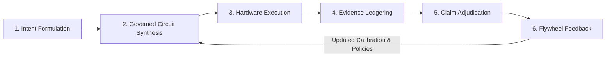

# The Quantum Flywheel: Closed-Loop Governed Quantum Synthesis

**Grant Submission:** BlueQubit Quantum Flywheel Open Call 2026  
**Document:** Mechanics of the Quantum Flywheel Feedback Loop  
**Release Reference:** `OSIRIS-LIVLM-BETA-0.1.0-REF`  

---

## 1. Conceptual Framework

A conventional quantum computing pipeline is open-loop: a developer writes a circuit, submits it to a quantum processing unit (QPU), retrieves a probability distribution or expectation value, and manually interprets the results. If errors occur or noise degrades state fidelity, remediation requires ad-hoc manual adjustment.

The **Quantum Flywheel** transforms this paradigm into a self-reinforcing, closed-loop epistemic cycle:

$$\text{User Intent} \longrightarrow \text{Governed Synthesis} \longrightarrow \text{Hardware Execution} \longrightarrow \text{Cryptographic Evidence} \longrightarrow \text{Automated Adjudication} \longrightarrow \text{Policy/Circuit Adaptation} \longrightarrow \text{Refined Execution}$$

Every iteration through the flywheel produces permanent, immutable evidence that tightens governance constraints and optimizes future computational steps.



---

## 2. The 6-Stage Flywheel Cycle

### Stage 1: User / Pilot Intent Formulation
The user supplies natural-language guidance or a programmatic task (e.g., *"Benchmark genetic quantum circuit on 8 qubits with zero unauthorized side effects"*). The `IntentEngine` maps this input into a typed proposal structure, specifying required capabilities, bounds, and a client nonce.

### Stage 2: Governed Circuit Synthesis (OSIRIS Boundary)
Before any execution begins, the proposal undergoes strict parsing and serialization via `OSIRIS-CANONICAL-JSON-V1`:
1. Reject floats, duplicate keys, and bidirectional Unicode.
2. Sort keys lexicographically and compute the canonical SHA-256 request digest:
   $$h_{\text{req}} = \text{SHA-256}(b_{\text{canonical}})$$
3. The `CapabilityGovernor` asserts execution permissions, matches capabilities (`REPLAY` vs `EXPERIMENT`), verifies timestamp validity, and confirms in-epoch nonce uniqueness.
4. If approved, an execution permit is issued and bound to $h_{\text{req}}$.

### Stage 3: Controlled Quantum Execution
The execution adapter dispatches the parameterized circuit to either the offline reference simulator or the physical BlueQubit IBM Heron backend:
- The circuit implements DNA-Lang bio-inspired quantum operators (`fold`, `twist`, `splice`, `bond`).
- Execution parameters (gate depth, shots, transpiler seed) are locked and recorded.
- Raw measurement bitstrings are collected alongside backend calibration telemetry ($T_1, T_2$, readout error rates).

### Stage 4: Cryptographic Evidence Ledgering
All execution telemetry is immediately recorded in the `DynamicEvidenceLedger`:
- The event is assigned an immutable record digest:
  $$h_{\text{event}}^{(i)} = \text{SHA-256}\left( h_{\text{event}}^{(i-1)} \,\|\, \text{Scope} \,\|\, \text{Payload} \,\|\, \text{Timestamp} \right)$$
- The Evidence Non-Substitution Invariant is strictly applied: runtime telemetry is filed under `HARDWARE_EXECUTION` or `SCIENTIFIC_EXPERIMENTAL` planes, preventing it from masquerading as a deployment authorization.
- Mutable references are forbidden; all artifacts are pinned to their SHA-256 content digests.

### Stage 5: Independent Adjudication & Replication
Independent evaluators or automated verification agents inspect the ledger:
- Check hash chain continuity from the genesis block.
- Verify that experimental observations match claimed thresholds (e.g., cross-entropy benchmarking score $XEB \ge 0.95$).
- Evaluate claims under adverse-first precedence: any contradictory finding immediately revokes claim validity.

### Stage 6: Flywheel Feedback & Policy Adaptation
The validated evidence feeds directly back into the system to drive iterative improvements:
1. **Noise-Aware Circuit Synthesis:** If readout error on a specific qubit pair exceeds baseline thresholds in the evidence record, the compiler adaptively remaps the circuit's active subspace.
2. **Dynamic Error Mitigation:** Error mitigation parameters (e.g., zero-noise extrapolation scale factors) are adjusted based on historical ledgered performance.
3. **Governance Policy Hardening:** If an unexpected execution boundary or high latency was observed, the `CapabilityGovernor` tightens timeout budgets and quota controls for subsequent runs.

---

## 3. Mathematical Formalism of Flywheel Convergence

Let $\mathcal{C}_k$ denote the $k$-th generated quantum circuit, and $\mathcal{E}_k$ denote the immutable evidence package produced by its execution:

$$\mathcal{E}_k = \left( h_{\text{req}}^{(k)}, \, \mathcal{S}_{\text{scope}}^{(k)}, \, \mathcal{T}_{\text{telemetry}}^{(k)}, \, h_{\text{ledger}}^{(k)} \right)$$

The quality metric $\mathcal{Q}(\mathcal{E}_k)$ measures fidelity, negentropy $\Xi$, and governance compliance:

$$\mathcal{Q}(\mathcal{E}_k) = \alpha \cdot \text{XEB}(\mathcal{T}_k) + \beta \cdot \Xi(\mathcal{T}_k) - \gamma \cdot \text{Cost}(\mathcal{C}_k)$$

The adaptive synthesizer updates circuit parameters $\vec{\theta}_{k+1}$ by gradient-free Bayesian optimization over the history of ledgered packages $\{\mathcal{E}_1, \dots, \mathcal{E}_k\}$:

$$\vec{\theta}_{k+1} = \arg\max_{\vec{\theta}} \, \mathbb{E}\left[ \mathcal{Q}(\mathcal{E}) \mid \mathcal{E}_{1:k} \right]$$

Because every data point in $\mathcal{E}_{1:k}$ is cryptographically tamper-evident, the optimization landscape cannot be poisoned by spoofed runs or phantom executions. This creates an uncompromised, self-improving flywheel.


---

## 4. Track 2 Adversarial Grounding & Evidence Separation

In accordance with BlueQubit Track 2 (Breaking Quantum Advantage Claims), the Flywheel does not optimize solely for nominal fidelity; it stress-tests candidate quantum outputs against an escalating classical adversarial ladder:

```text
Target Quantum Benchmark
           │
           ▼
[Attack Level 0] Exact Small-Instance Statevector Reference (M <= 24)
           │
           ▼
[Attack Level 1] Matrix Product State (MPS) Tensor Network Sweep (chi in [16, 256])
           │
           ▼
[Attack Level 2] Pauli-Path / Clifford+T Hybrid Classical Expansion
           │
           ▼
[Attack Level 3] Heuristic / Evolutionary Classical Search via LivLM
           │
           ▼
     Adjudication
(Advantage verified ONLY if all 4 classical attacks fail under budget)
```

### Coverage-Adjusted Entropy Estimator Invariant
To prevent the recurrence of sampling artifacts where high-shot distributions ($10^6$ shots on 156 qubits) mimic entropy suppression simply because sample coverage $\hat{C} \approx 0$, the Flywheel forbids naive plug-in entropy:

$$\hat{C} = 1 - \frac{f_1}{N}$$

When $\hat{C} < 0.1$, the ledger mandates coverage-adjusted estimators (Miller-Madow, Chao-Shen, NSB) or halts claim evaluation, formally refuting artifactual advantage claims.

### The Three Evidence Planes
All data produced across flywheel cycles is segregated into three orthogonal, non-substituting planes:
1. **Operational (OEP):** Confinement, execution nonces, host environment telemetry.
2. **Scientific (SEP):** Classical attack traces, QPU raw bitstrings, coverage metrics.
3. **Cross-Plane (XPL):** Strict immutable bindings linking identical software lineages without allowing operational failures to pollute scientific models, or scientific promise to bypass operational release gates.
