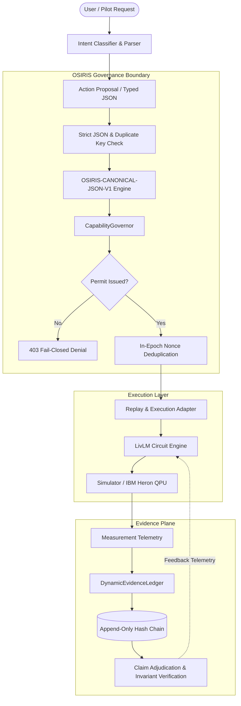

# Technical Architecture: Living Language Model & OSIRIS Governance Stack

**Architecture Version:** 1.0  
**Release Reference:** `OSIRIS-LIVLM-BETA-0.1.0-REF`  
**Components:** Living Language Model, DNA-Lang, OSIRIS Governance, QPU Adapter  

---

## 1. System Overview

The system architecture cleanly decouples five layers:
1. **User / Intent Layer:** Natural language interface and intent parsing.
2. **Living Language Model Engine (LivLM):** Bio-quantum token encoding, phase memory, and circuit generation.
3. **OSIRIS Governance Boundary:** Canonical serialization, pre-adapter authorization, and capability verification.
4. **Execution & Hardware Plane:** Aer simulator backend (current) and BlueQubit IBM Heron QPU (target).
5. **Evidence Ledger & Provenance Plane:** Tamper-evident hash-chained audit trails and independent claim adjudication.

---

## 2. Living Language Model (LivLM) Mechanics

The LivLM core (implemented in `osiris_livlm.py`) utilizes a bio-computational framing:
- **`TextEncoder`:** Translates UTF-8 input strings into 8-qubit quantum states. Each byte $b \in [0, 255]$ maps to a single-qubit rotation angle:
  $$\theta = \frac{b \cdot 2\pi}{256}$$
- **`GenerationCircuit`:** Constructs parameterized DNA-Lang quantum circuits implementing biological analogues:
  - `fold`: Single-qubit Pauli-Z rotations and parameterized phase gates.
  - `twist`: Multi-qubit entangling gates (CNOT and CZ ladders).
  - `splice`: Controlled swap operations exchanging state subspaces.
  - `bond`: Parameterized phase accumulation across entangling chains.
- **`PhaseMemory`:** Maintains quantum phase registers reflecting ongoing interaction context.
- **Negentropy Metric ($\Xi$):** Measures coherent information gain versus classical thermal dispersion during generation cycles.

---

## 3. OSIRIS Governance & Deterministic Enforcement

Execution is strictly subordinated to the OSIRIS governance plane:
- **`OSIRIS-CANONICAL-JSON-V1`:** Every request proposal is normalized to an exact, unique byte sequence before hashing.
  - Rejects IEEE 754 floating-point values at parse time.
  - Rejects duplicate object keys.
  - Enforces Unicode NFC normalization and strips bidirectional control codepoints.
  - Lexicographically sorts keys using ASCII code-point ordering.
- **`CapabilityGovernor`:** Evaluates proposals *before* any adapter execution occurs.
  - Asserts capability matching (`REPLAY` or `EXPERIMENT`).
  - Asserts scope confinement (`REPLAY_ONLY_NON_CRYPTOGRAPHIC`).
  - Checks proposal expiration timestamps against UTC clocks.
  - Performs in-epoch nonce deduplication to prevent replay attacks.
- **`DynamicEvidenceLedger`:** A cryptographically chained append-only ledger that logs every transition.
  - Implements the **Evidence Non-Substitution Invariant**: runtime-security evidence cannot substitute for scientific or deployment authorization claims.
  - Applies **Adverse-First Precedence**: any contradictory or adverse finding immediately resolves claim status to `FALSE` or `BLOCKED`.
  - Rejects mutable artifact labels (`:latest`, `main`) in favor of immutable cryptographic digests.

---

## 4. Hardware Execution Target (IBM Heron via BlueQubit)

The target hardware environment is IBM's 156-qubit Heron processor, accessed via BlueQubit's cloud API:
- **Coupling Map:** Tunable coupler architecture minimizing cross-talk.
- **Active Subspace:** 8-qubit register mapped to high-coherence physical qubit chains ($T_1, T_2 \ge 120\,\mu\text{s}$).
- **Compilation Pipeline:** Qiskit transpiler level 3 optimization with dynamic decoupling pulses.
- **Measurement Mitigation:** Matrix-free measurement mitigation (M3) calibrated against daily backend snapshot data.
