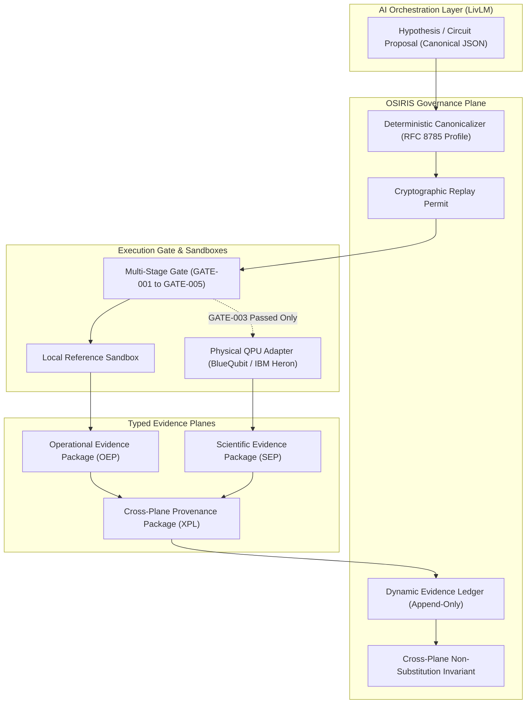

# OSIRIS / LivLM Project Charter: Quantum-Classical Governance Architecture

**Document ID:** `CHARTER-OSIRIS-LIVLM-TRACK2`  
**Authoritative Manifest:** [`project/PROJECT_MANIFEST.json`](file:///home/enki/osiris-governance/project/PROJECT_MANIFEST.json)  
**Schema:** `OSIRIS-PROJECT-MANIFEST-1`  
**Current Git Anchor:** Commit `ba09973` | Tag [`v0.1.0-beta.1`](file:///home/enki/osiris-governance/RELEASE_MANIFEST.json)  
**Program Status:** BlueQubit Quantum Flywheel Track 2 (Proposal / Prospective Research Package)  
**Archival DOIs:** Concept [`10.5281/zenodo.22980007`](https://doi.org/10.5281/zenodo.22980007) | Version 2 [`10.5281/zenodo.22980258`](https://doi.org/10.5281/zenodo.22980258) | Proposal [`10.5281/zenodo.22863245`](https://doi.org/10.5281/zenodo.22863245)

---

## 1. Executive Summary

The OSIRIS / Living Language Model (LivLM) project establishes a rigorous, evidence-governed framework for orchestrating and evaluating quantum-classical computation. Positioned for **BlueQubit Quantum Flywheel Track 2**, the project prioritizes **adversarial classical verification** and **cryptographic reproducibility** over unsubstantiated claims of quantum supremacy.

Rather than asserting premature quantum advantage, OSIRIS provides the foundational infrastructure required to stress-test, measure, and potentially refute candidate quantum circuits against an escalating 4-level hierarchy of classical simulation methods. In this paradigm, an empirical refutation of a quantum advantage claim under classical attack is considered a **successful, highly valuable Track 2 scientific outcome**.

The architecture enforces strict separation between **Operational**, **Scientific**, and **Provenance** evidence planes under the **Evidence Non-Substitution Invariant**: runtime security cannot prove scientific validity, and scientific or algorithmic passes cannot authorize operational deployment.

---

## 2. Research Problem & Track 2 Alignment

Modern quantum-advantage claims frequently suffer from three fundamental vulnerabilities:
1. **Confirmatory Bias:** Evaluating circuits only against unoptimized or weak classical baselines while declaring quantum utility.
2. **Finite-Sample Estimator Collapse:** Utilizing naive plug-in Shannon entropy on undersampled Hilbert spaces ($M \ge 100$ qubits, sample coverage $C \ll 0.1$), where severe singleton sparsity creates the statistical illusion of entropy suppression.
3. **Evidence Laundering:** Treating successful local software test execution as authorization for cloud deployment, or treating simulator outputs as physical hardware validation.

### Track 2 Objective
The project aligns with BlueQubit Track 2 by constructing:
- A **4-level Classical Attack Ladder** (Exact Statevector, Matrix Product State Tensor Networks, Pauli-Path / Clifford+T expansions, and Heuristic Search) to delineate the empirical boundary of classical simulability.
- A **Governed AI Orchestration Layer** where Living Language Models propose and optimize circuits within deterministic, cryptographically bound execution envelopes.
- **Coverage-Adjusted Entropy Estimators** (Miller-Madow, Chao-Shen, Nemenman-Shafee-Bialek) to eliminate finite-sample statistical artifacts.

---

## 3. Architecture Summary

The OSIRIS / LivLM architecture is organized into four distinct layers:



---

## 4. Governed Scientific Lifecycle

The operational path from research question to public release follows an immutable, mechanically enforced chain of custody:

$$\text{RESEARCH QUESTION} \longrightarrow \text{OBJECTIVE} \longrightarrow \text{CRITERION} \longrightarrow \text{WORK PACKAGE} \longrightarrow \text{TASK} \longrightarrow \text{EXPERIMENT} \longrightarrow \text{EVIDENCE} \longrightarrow \text{PROVENANCE} \longrightarrow \text{GATE} \longrightarrow \text{DELIVERABLE} \longrightarrow \text{RELEASE}$$

1. **AI Proposes:** LivLM synthesizes candidate quantum circuits and parameterized DNA-Lang grammars.
2. **Deterministic Tooling Measures:** Classical simulators and hardware backends produce raw measurement bitstrings.
3. **Evidence Packages Preserve:** Immutable JSON packages record environment, seeds, raw counts, and cryptographic receipts.
4. **Adjudication Decides:** Adverse-first logic assigns explicit epistemic dispositions (`SUPPORTED`, `REFUTED`, `INCONCLUSIVE`, `NOT_EVALUATED`).

---

## 5. What Has Been Established vs. What Has Not

| Domain | Established / Verified State | What Is NOT Established |
| :--- | :--- | :--- |
| **Local Software** | 65/65 unit and integration tests passing green; deterministic canonical serializer verified; replay governor validated. | Does NOT establish operational confinement in cloud environments or physical hardware execution. |
| **Operational Deployment** | Real operational deployment campaign ([`REAL-CAMPAIGN-20260926T160434Z`](file:///home/enki/osiris-governance/evidence/operational/REAL-CAMPAIGN-20260926T160434Z/MANIFEST.json)) observed active confinement failure ($S_{\text{deployed}} = \text{FALSE}$); gate blocked cloud deployment. | Cloud deployment is strictly **BLOCKED**; zero unconfined operational deployments authorized. |
| **Cross-Plane Provenance** | Immutable non-substitution binding ([`XPL-2026-09-26-001`](file:///home/enki/osiris-governance/evidence/provenance/XPL-2026-09-26-001/MANIFEST.json)) links operational failure and scientific baseline to shared commit `8df61dc`. | Does NOT permit operational failure to invalidate scientific schema, nor scientific schema to authorize deployment. |
| **Scientific Benchmark** | Baseline protocol and claims $QF\text{-}001$ through $QF\text{-}005$ frozen in [`SEP-QF-2026-001`](file:///home/enki/osiris-governance/evidence/scientific/SEP-QF-2026-001/MANIFEST.json); Level 0 exact Aer statevector baseline simulated. | Does NOT establish physical quantum advantage, QPU superiority, or classical unsimulability. |
| **Hardware Execution** | Gate condition [`GATE-003`](file:///home/enki/osiris-governance/project/GATES.json) (QPU Eligibility) is **BLOCKED**; no physical QPU jobs authorized or dispatched. | Zero hardware executions performed. BlueQubit API integration is prospective. |
| **Public Release** | Tag [`v0.1.0-beta.1`](file:///home/enki/osiris-governance/RELEASE_MANIFEST.json) released as **Reference Implementation (Not Deployment-Attested)**; published to GitHub and archived on Zenodo. | Release is self-reported until independently fetched; does NOT constitute a production-certified cloud deployment. |

---

## 6. Authoritative Master Status

```
OSIRIS MASTER STATUS:
  Source Commit:                ba09973
  Local Governance Tests:       65/65 PASS
  S_deployed:                   FALSE (REAL-CAMPAIGN-20260926T160434Z)
  Confinement Violations:       Seccomp mode 0, network egress, /tmp write
  LocalReferenceReleaseAllowed: TRUE
  CloudDeploymentAllowed:       FALSE (BLOCKED)
  ConfirmatoryExecution:        PROHIBITED
  Release Anchor:               v0.1.0-beta.1 REFERENCE IMPLEMENTATION (NOT DEPLOYMENT-ATTESTED)
  Zenodo Release Record:        Reported published (Concept: 10.5281/zenodo.22980007, Version 2: 10.5281/zenodo.22980258)
  GitHub Release:               Reported published (v0.1.0-beta.1 at ba09973)
  BlueQubit Program State:      PROPOSAL / RESEARCH PACKAGE / PROSPECTIVE
  Scientific Claims (QF-001..5):UNVERIFIED / PROSPECTIVE (No quantum advantage established)
```

---

## 7. Key Project Risks & Mitigations

1. **`RISK-OPS-001` (Unconfined Deployment Environment):** Observed in real testing. Mitigated by immutably freezing the failure record, tripping the deployment gate, and blocking cloud execution until a fresh campaign ID passes under hardened Linux namespace/seccomp confinement.
2. **`RISK-SCI-001` (Quantum Advantage Not Established):** High probability. Mitigated by designing Track 2 around adversarial falsification—establishing the limits of classical simulation is the primary metric of scientific success.
3. **`RISK-SCI-003` (Finite-Sample Estimator Collapse):** Critical impact. Mitigated by mathematically fording plug-in entropy when $C < 0.1$ and requiring coverage-adjusted estimators in protocol specifications.
4. **`RISK-GOV-001` (Evidence-Plane Substitution):** Critical impact. Mitigated by machine-enforced schema validation rejecting cross-plane promotion in the execution gate.

---

## 8. Governance Invariants

- **Invariant 1 (Non-Manufacture of Evidence):** Documentation is not evidence. An assertion without an immutable cryptographic receipt is unverified.
- **Invariant 2 (Adverse-First Precedence):** A single negative operational probe or classical refutation overrides all positive affirmations.
- **Invariant 3 (Evidence Non-Substitution):** Evidence can only support claims within its declared operational plane.
- **Invariant 4 (Historical Immutability):** Negative findings and failed deployment campaigns are permanently preserved as falsifying evidence, never deleted or overwritten.
